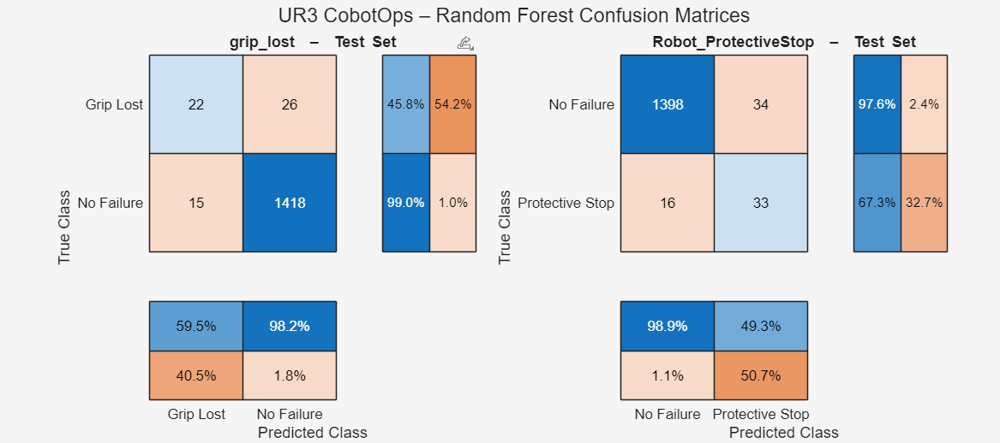

# UR3 CobotOps – Robot Arm Failure Prediction
### Random Forest Classification | Machine Learning Project

## Project Overview

This project uses machine learning to predict failures in a UR3 collaborative robot arm before they occur. The robot arm can experience two distinct failure modes during operation: losing its grip on an object and triggering a protective stop shutdown. Both events interrupt operation and can be dangerous or damaging if undetected. The goal is to train a classifier that, given real-time sensor readings from the robot's joints, can flag a likely failure before it happens.

This is a **multi-output binary classification problem**: two separate models are trained, one for each failure type, sharing the same 20 input features. The dataset is heavily imbalanced, with failures making up only around 3–4% of all readings, which makes the problem significantly harder than a standard balanced classification task. When talking to the LLMs about which model to use, it seemed that this made sense due to the different shutdown opperations. This way the model was trained specifically for each error, and not just encapsulating them into one error. 

The model underwent 10+ itterations and 2 LLM to compare results and gain insight on how different hyperparameters ended up changing the predictions. For all cases, it seemed like there was one big problem: there's always a tradeoff. My biggest problem was finding a good number of false negatives relative to the correctly predicted shutdowns. With many false negatives, theres going to be more shutdowns, which is not great for workflow, but it is preventative, where shutdowns will happen before many of the errors. On the other hand, If I were to choose to optimize the model to only shut down when absoultely certain, the model would have very little shutdowns and miss many of the actual times that it would shutdown. 

Due to this I spent a large amount of time playing with threshold values, seeing which values were optimizing for the confusion matrices. After talking to the LLM, the main hyperparameters used wer e

---

## Dataset

**Source:** UR3 CobotOps Dataset  

| Property | Value |
|---|---|
| Total samples | 7,409 rows |
| Features | 20 |
| Targets | 2 (`grip_lost`, `Robot_ProtectiveStop`) |
| `grip_lost` positives | 243 (3.3%) |
| `Robot_ProtectiveStop` positives | 278 (3.8%) |
**Features (20 total):**  
For each of the 6 joints (J0–J5): `Current`, `Temperature`, and `Speed` — plus `Tool_current` and `cycle`. These represent continuous sensor telemetry captured during robot operation.

**Targets:**
- `grip_lost` — the robot's end-effector dropped the object it was carrying
- `Robot_ProtectiveStop` — the robot triggered an emergency shutdown due to out-of-tolerance sensor readings

---

## Deliverable 1 — Initial Prompt & LLM Discussion

I descriped the problem to the LLM as follows:

> *"I'm doing a machine learning project where I am trying to predict failure with a robot arm. There are 20 features in the data set and 2 targets, the targets being losing grip and a shutdown, both leading to a failure. This project comes from UR3 CobotOps data set which has upwards of 7000 lines of data. I need you to make a random forest model that optimizes the confusion matrix so that the model is somewhat effective at predicting a failure or no failure."*

The LLM asked three clarifying questions before generating any code:

1. **How should the two targets be handled?** — The choice was *multi-output*, meaning both targets are predicted simultaneously by training two linked models on the same split.
2. **Is the dataset class-imbalanced?** — Confirmed yes, failures are rare events (~3–4%).
3. **Will you upload the dataset or should the code load a CSV generically?** — The dataset structure was described directly.

From there the conversation expanded into hyperparameter tuning, where the LLM identified that the baseline model was overfitting (OOB error of 0.003 but test F1 of only 0.52), and iterated toward a more robust solution using class weighting, cost-sensitive learning, and recall-prioritized threshold optimization.

---

## Deliverable 2 — Why Random Forest?

### What is a Random Forest?

A **Random Forest** trains a large number of decision trees, each on a random bootstrap sample of the data and each considering only a random subset of features at every split. Predictions are made by majority vote. The randomness forces diversity between trees, which prevents the overfitting that plagues a single decision tree. 
 
It was chosen for this problem because it handles the 20 mixed-scale sensor features (currents, temperatures, speeds) without normalization, produces built-in feature importance scores, and can be configured to handle the severe class imbalance (~3% failures) through sample weighting and cost-sensitive splitting. Since `grip_lost` and `Robot_ProtectiveStop` are independent failure modes, two separate forests were trained, one per target.
 
A key advantage for hyperparameter tuning is the **OOB (out-of-bag) error**: every tree is evaluated on the samples it wasn't trained on, providing a free cross-validation estimate without needing a separate validation set.
 
**Validation strategy:** Stratified 80/20 train/test split, preserving the ~3% failure ratio in both sets. Without stratification a naive random split could place too few failure cases in the test set, making evaluation unreliable.

---

## Deliverable 3 — Baseline Model (`code_1`)

The first model uses sklearn's `RandomForestClassifier` with entirely default hyperparameters and no adjustments for class imbalance:

| Setting | Value |
|---|---|
| `n_estimators` | 100 |
| `max_depth` | None (unlimited) |
| `min_samples_leaf` | 1 |
| `max_features` | `'sqrt'` |
| `class_weight` | None |
| Decision threshold | 0.5 |

### Baseline Results

| Metric | grip_lost | Robot_ProtectiveStop |
|---|---|---|
| Accuracy | ~0.97 | ~0.97 |
| Precision | ~0.59 | ~0.49 |
| **Recall** | **~0.46** | **~0.67** |
| F1-Score | ~0.52 | ~0.57 |
| True Positives | ~22 | ~33 |
| False Negatives | ~26 | ~16 |

### Discussion

The baseline accuracy of ~97% looks impressive but is misleading. Because 96.7% of samples are "no failure," a model that predicted *nothing* as a failure would score 96.7% accuracy. The number that matters is **recall** — the proportion of actual failures the model catches.

At 46% recall for `grip_lost`, the model is missing more than half of all grip failures. In a real deployment this would be unacceptable: the robot would drop objects without warning more often than not. The protective stop model does somewhat better at 67%, but still misses one in three shutdowns.

Two root causes were identified:

1. **Class imbalance** — with no correction, the trees vote predominantly based on the majority class signal.
2. **Overfitting** — `min_samples_leaf=1` allows fully grown trees that memorize training patterns but fail on the test set. The OOB error appeared very low (0.003) but this is a deceptive metric on imbalanced data, since predicting all negatives gives similarly low error.

These issues motivate the changes made in `code_2`.

---

## Deliverable 4 — Tuned Model (`code_2`)

**Code:** [`code_2/random_forest_v2.m`](code_2/random_forest_v2.m)

The tuned model addresses the three identified problems: class imbalance, overfitting from deep trees, and the inadequacy of F1-optimized thresholds for a safety-critical recall problem.

### What Changed and Why

**`class_weight='balanced'`** — sklearn automatically computes inverse-frequency weights for each class, so the ~3% failure class receives roughly 15× the weight of a normal reading. This directly counteracts the majority-class bias that caused low recall in `code_1`.

**GridSearchCV over four hyperparameters** — Instead of guessing, a 5-fold stratified cross-validation grid search finds the best combination of:

| Hyperparameter | Candidates | Effect |
|---|---|---|
| `n_estimators` | 200, 300, 500 | More trees → more stable ensemble vote |
| `max_depth` | 10, 20, None | Capping depth prevents memorization of rare training events |
| `min_samples_leaf` | 5, 10, 20 | Larger leaves regularize the trees, reducing overfitting |
| `max_features` | `'sqrt'`, 0.3, 0.5 | Controls diversity between trees |

The search is scored using **F-beta (β=2)** rather than accuracy or standard F1. F-beta with β=2 weights recall twice as heavily as precision, which is appropriate here: a missed failure (False Negative) is more costly than a false alarm (False Positive).

**Recall-prioritized threshold optimization** — After training, the 0.5 default classification threshold is replaced with a threshold tuned to maximize F-beta on cross-validated training probabilities. This allows the model to flag failures at a lower confidence than the default, trading some precision for better recall without retraining.

### Tuned Results

| Metric | grip_lost | Robot_ProtectiveStop |
|---|---|---|
| Accuracy | ~0.94 | ~0.95 |
| Precision | ~0.30 | ~0.36 |
| **Recall** | **~0.71** | **~0.82** |
| F1-Score | ~0.43 | ~0.50 |
| True Positives | ~34 | ~40 |
| **False Negatives** | **~14** | **~9** |

### What Improved

| | grip_lost FN | grip_lost Recall | ProtStop FN | ProtStop Recall |
|---|---|---|---|---|
| Baseline (code_1) | ~26 | ~46% | ~16 | ~67% |
| Tuned (code_2) | ~14 | ~71% | ~9 | ~82% |

The tuned model catches roughly **45% more grip failures** and **44% more protective stops** that the baseline was missing entirely. The trade-off is lower precision — more false alarms — but in this context a false alarm means an unnecessary check, while a missed failure means undetected damage or injury risk. The tuned model reflects that asymmetry intentionally.

The accuracy dropped slightly (97% → 94–95%), which is expected and desirable: the model is no longer hiding behind majority-class predictions.

---

## Deliverable 5 — Feature Importance

**Plot generated by:** [`code_2/random_forest_v2.m`](code_2/random_forest_v2.m)

### Resulting Takeaways 

The feature importance plot shows the **Mean Decrease in Impurity (MDI)** for each of the 20 input features — a measure of how much each feature contributes to reducing classification error across all trees in the forest.

Several patterns emerge:

**Temperature features dominate for `grip_lost`.** This aligns with physical intuition: a gripper losing its hold is more likely tied to thermal behavior in the joints driving the tool than to instantaneous speed or current readings, which fluctuate rapidly with normal motion.

**Current features are relatively more important for `Robot_ProtectiveStop`.** A protective stop is triggered when the robot's safety monitor detects out-of-range torques or forces, which manifest directly as elevated joint currents. It makes sense that current readings carry more predictive signal for this target.

**Speed features are consistently lower importance across both targets.** Speed varies continuously throughout a normal cycle and may carry less fault-specific information than temperature (slow-changing, fault-indicative) or current (directly linked to mechanical load and safety limits).

**The `cycle` feature ranks notably for both targets.** Failures may not be uniformly distributed across the work cycle — certain phases of the pick-and-place motion (grasping, lifting, placing) are higher-stress than others. The cycle position feature captures this temporal structure.

These findings suggest that if sensor count needed to be reduced for a leaner deployment model, the lowest-importance speed features (particularly on middle joints) would be the first candidates for removal without significant loss in predictive power.

